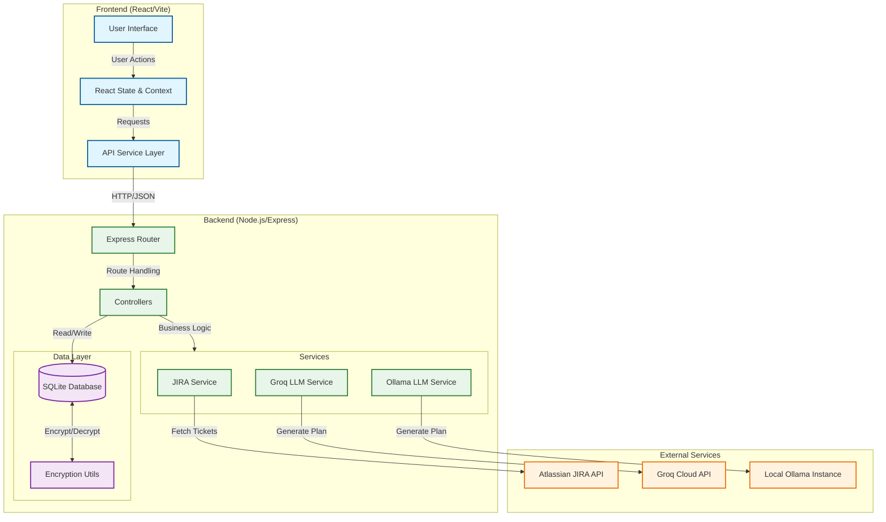

# 🚀 AI Test Plan Creator Agent



An intelligent agent that drastically reduces the time QA engineers spend on test planning. By integrating directly with **JIRA** and leveraging powerful **Large Language Models (LLMs)** like Groq (Llama 3) and Ollama, this tool automatically generates comprehensive, professional test plans from JIRA ticket details.

## ✨ Key Features

-   **🔌 JIRA Integration**: Seamlessly fetch ticket details (Description, Acceptance Criteria, Priority) directly from your JIRA instance.
-   **🧠 AI-Powered Generation**:
    -   **Cloud**: Ultra-fast generation using Groq (Llama 3 70B).
    -   **Local**: Privacy-focused generation using Ollama (Llama 3, Mistral, etc.).
-   **📝 Custom Templates**: Upload your own PDF templates to ensure test plans match your organization's specific format.
-   **⚡ Modern UI**: sleek, responsive dashboard built with React, Vite, and Tailwind CSS.
-   **💾 History & Management**: Save, view, and manage previously generated test plans.
-   **🔒 Secure**: API keys and tokens are encrypted at rest using SQLite.

## 🛠️ Tech Stack

### Frontend
-   **React 18**
-   **Vite**
-   **Tailwind CSS**
-   **Typescript**
-   **Lucide React** (Icons)

### Backend
-   **Node.js**
-   **Express**
-   **SQLite** (Data persistence)
-   **Better-SQLite3**

### AI & Services
-   **Groq SDK**
-   **Ollama**
-   **JIRA REST API**

## 🚀 Getting Started

### Prerequisites
-   Node.js (v16+)
-   npm or yarn
-   A JIRA account (for fetching tickets)
-   (Optional) Groq API Key
-   (Optional) Ollama installed locally

### Installation

1.  **Clone the repository**
    ```bash
    git clone https://github.com/Kotagimani/AI-Tester-BluePrint.git
    cd AI-Tester-BluePrint/Project1-TestPlanCreator_AI_Agent
    ```

2.  **Install Backend Dependencies**
    ```bash
    cd app/backend
    npm install
    ```

3.  **Install Frontend Dependencies**
    ```bash
    cd app/frontend
    npm install
    ```

4.  **Start the Application**
    You need to run both the backend and frontend.

    *Terminal 1 (Backend):*
    ```bash
    cd app/backend
    npm start
    ```

    *Terminal 2 (Frontend):*
    ```bash
    cd app/frontend
    npm run dev
    ```

5.  **Open in Browser**
    Navigate to `http://localhost:3000`

## ⚙️ Configuration

1.  **Go to Settings** in the application.
2.  **JIRA**: Enter your JIRA Base URL, Username, and API Token.
3.  **LLM Provider**:
    -   Select **Groq** and enter your API Key for fast, cloud-based generation.
    -   Select **Ollama** and ensure your local Ollama instance is running (default: `http://localhost:11434`).

## 📸 Screenshots

*(Add screenshots of validity here)*

## 🤝 Contributing

Contributions are welcome! Please feel free to submit a Pull Request.

## 📄 License

This project is licensed under the MIT License.
